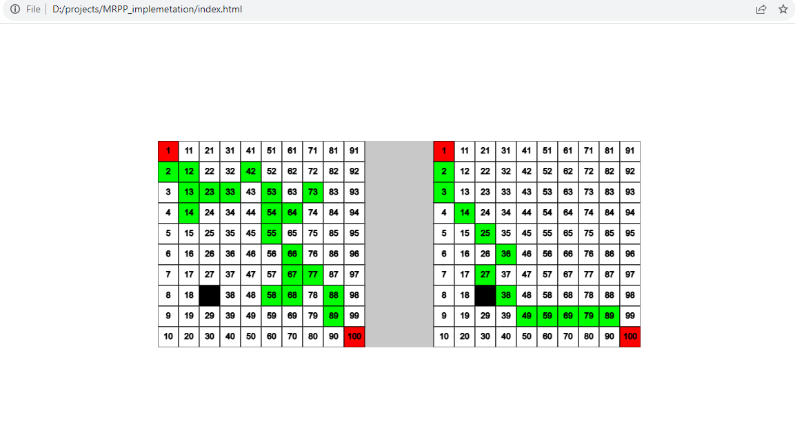

# MRPP Solver
This is a simplified implementation based on an article stating Mobile Robot’s Path Planning Problem (MRPPP). 
MRPP Solver is a web application that tackles the Multiple Robot Path Planning problem using a genetic algorithm. It visualizes the process of finding the optimal paths for multiple robots to navigate from a start grid to a target grid while avoiding obstacles.

## Getting Started

To run the MRPP Solver, simply open the `index.html` file in a modern web browser. The application allows you to set the grid dimensions, the number of robots, and visualize how the genetic algorithm evolves paths over generations.

## Features

- **Multiple Robots:** Solve path planning for multiple robots simultaneously.
- **Genetic Algorithm:** Utilizes a genetic algorithm to evolve optimal paths.
- **Visualization:** Visualize the evolving paths and obstacles on the grid.
- **Obstacle Avoidance:** Robots find paths around obstacles placed on the grid.
- **Dynamic Population:** Set the population size to observe how different populations influence the solution.

## Usage

1. Open `index.html` in a web browser.
2. Enter the grid dimensions and the number of robots.
3. Click "Start" to visualize the genetic algorithm finding optimal paths.
4. Observe the paths, obstacles, and generations in the visualization.

## Screenshots

## License

This project is licensed under the MIT License - see the [LICENSE](LICENSE) file for details.

## Acknowledgements

- This project uses the [p5.js](https://p5js.org/) library for graphics and animation.

